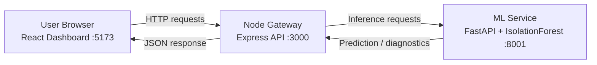

# Samanvaya (समान्वय)

A full-stack lunar telemetry and anomaly-monitoring project with:
- **ML microservice** (FastAPI + IsolationForest)
- **API gateway** (Node.js + Express)
- **Web UI** (React + Vite + Tailwind)

---

## What this project does

Samanvaya simulates and monitors lunar-registration telemetry (like RMSE, inlier ratio, and spatial entropy), detects anomalies, and shows results in a modern dashboard.

---

## Tech stack

- **Frontend:** React, TypeScript, Vite, Tailwind, Recharts
- **Gateway:** Node.js, Express, TypeScript
- **ML service:** Python, FastAPI, scikit-learn
- **Dev tooling:** npm, Make, Docker Compose

---

## Quick start

### Prerequisites
- Node.js 18+
- Python 3.10+
- npm

### Install dependencies

```bash
pip install -r requirements.txt
pip install -e .
cd backend && npm install && cd ..
cd frontend && npm install && cd ..
npm install
```

### Run everything (recommended: one command)

```bash
npm start
```

This starts:
- ML service: `http://localhost:8001`
- Gateway: `http://localhost:3000`
- Frontend: `http://localhost:5173`

---

## Architecture (easy screen view)



### Runtime flow
1. User interacts with dashboard.
2. Dashboard sends requests to Node gateway.
3. Gateway calls ML endpoints for anomaly prediction.
4. Results return to UI for charting and status cards.

---

## Project structure

```text
Samanvaya/
├── frontend/              # React dashboard
│   └── src/
├── backend/               # Node.js gateway
│   └── src/index.ts
├── ml_service/            # FastAPI anomaly microservice
│   ├── main.py
│   └── services/
├── start.sh               # Linux/macOS launcher
├── start.ps1              # Windows launcher
├── package.json           # Cross-platform npm orchestration
├── Makefile
└── docker-compose.yml
```

---

## Why both `start.sh` and `start.ps1` exist

They are OS-specific launchers:
- `start.sh` → Bash script for Linux/macOS
- `start.ps1` → PowerShell script for Windows

They do similar work but in different shell syntax.

### Can we use one file?
Yes — and this repo now uses **one default cross-platform entry point**:

```bash
npm start
```

You can keep `start.sh`/`start.ps1` as optional helpers, but `npm start` is the simplest standard path for all OSes.

---

## Useful commands

```bash
# Start all services
npm start

# Start services individually
npm run ml
npm run gateway
npm run ui

# Run tests
make test

# Run with Docker
make docker
```

---

## API endpoints (ML service)

- `GET /` - health
- `POST /api/predict_anomaly` - single sample prediction
- `POST /api/predict_batch` - batch prediction
- `GET /api/top_anomalies` - top anomalies
- `POST /api/retrain` - retrain model

---

## License

MIT
