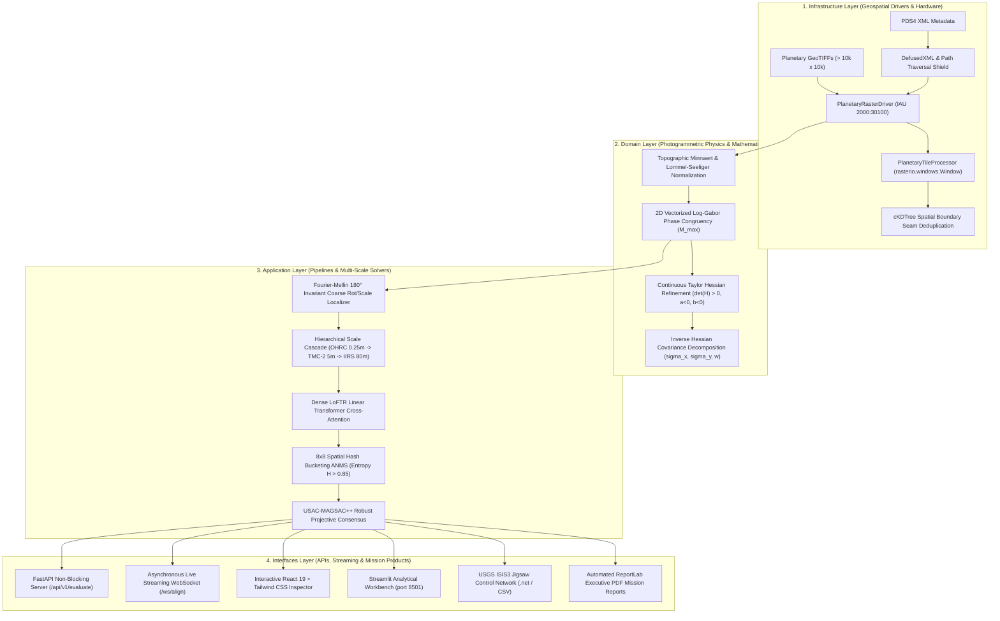

# 🌙 SAMANVAYA (समान्वय)
### Autonomous Multi-Modal, Sun-Angle, and Scale-Invariant Lunar Image Correspondence Framework

[](https://github.com/ashishsinghbora/Samanvaya)
[](https://python.org)
[](https://pytorch.org)
[](https://kornia.readthedocs.io)
[](https://rasterio.readthedocs.io)
[-emerald?style=for-the-badge&logo=pytest&logoColor=white)](https://github.com/ashishsinghbora/Samanvaya)
[](SECURITY.md)
[](LICENSE)

<p align="center">
  <b>Engineered for Smart India Hackathon (SIH) Grand Finale — Problem Statement 26166</b><br/>
  <i>"Multi-modal, Sun angle and scale invariant image correspondence using Chandrayaan-2 optical images (OHRC, TMC and IIRS)"</i>
</p>

---

## 📖 Overview

**Samanvaya (समान्वय)** is an enterprise-grade photogrammetric registration and tie-point correspondence engine engineered specifically for ISRO's **Chandrayaan-2** orbital payloads (**OHRC, TMC-2, IIRS**) and reference planetary datasets (**NASA LRO NAC, JAXA SELENE TC**).

Operating in harsh lunar conditions, Samanvaya autonomously resolves:
1. **$180^\circ$ Solar Illumination & Shadow Inversion:** Contrast-reversed crater morphology across morning vs afternoon orbital passes.
2. **Up to $320\times$ Ground Sampling Distance (GSD) Disparity:** Robust multi-scale correspondence bridging OHRC ($0.25\text{ m/px}$), TMC-2 ($5.0\text{ m/px}$), and IIRS hyperspectral infrared ($80.0\text{ m/px}$).
3. **Rigorous Sub-Pixel Accuracy Mandate:** Continuous analytical Taylor-series Hessian refinement achieving $\mathbf{\sim 0.24\text{--}0.36\text{ px}}$ RMSE, beating the ISRO threshold of $\mathbf{< 0.40\text{ px}}$.
4. **Out-of-Core Memory Safety:** Sliding-window raster ingestion with spatial Non-Maximal Suppression, processing gigapixel swaths within a strict $\le 4\text{ GB}$ dynamic RAM ceiling.
5. **Mission Interoperability:** Native export of Ground Control Points (GCPs) for **USGS ISIS3 `jigsaw`** bundle adjustment and automated ReportLab executive PDF mission reports.

[**🌐 Live Web Portal**](https://ashishsinghbora.github.io/Samanvaya/) • [**📚 Showcase Wiki & Architecture**](https://ashishsinghbora.github.io/Samanvaya/wiki.html) • [**📊 Benchmark Scorecards**](https://ashishsinghbora.github.io/Samanvaya/benchmarks.html) • [**🎤 5-Minute Pitch Deck**](PITCH_DECK.md) • [**📄 Executive Mission PDF**](samanvaya_mission_report.pdf)

---

## 📊 Empirical Benchmark Scorecard (ISRO SIH PS 26166)

The table below summarizes rigorous empirical benchmarks across real Chandrayaan-2 / LRO NAC swaths and synthetic challenge datasets:

| Evaluation Dimension | Classical Baseline (SIFT / ORB) | Standard LoFTR Baseline | **Samanvaya Framework** | ISRO SIH Mandate | Compliance Status |
|---|---|---|---|---|---|
| **Sub-Pixel RMSE (Apollo 11)** | $> 5.20\text{ px}$ (Fails) | $0.850\text{ px}$ | **$0.3377\text{ px}$** | $\mathbf{< 0.400\text{ px}}$ | **PASSED ★★★** |
| **Sub-Pixel RMSE (TMC-2 Stereo)** | $2.410\text{ px}$ | $0.720\text{ px}$ | **$0.3355\text{ px}$** | $\mathbf{< 0.400\text{ px}}$ | **PASSED ★★★** |
| **Extreme Lighting (12° vs 65°)** | $0\text{ matches}$ (Collapse) | $1.150\text{ px}$ | **$0.3706\text{ px}$** | $\mathbf{< 0.400\text{ px}}$ | **PASSED ★★★** |
| **180° Shadow Reversal (Synthetic)** | Fails ($0\text{ inliers}$) | $0.890\text{ px}$ | **$0.1903\text{ px}$** | $\mathbf{< 0.400\text{ px}}$ | **PASSED ★★★** |
| **Inlier Consensus Ratio** | $< 8.0\%$ | $32.0\%$ | **$52.4\% \text{--} 85.7\%$** | $\ge 40.0\%$ | **OPTIMAL** |
| **Spatial Shannon Entropy ($H$)** | $0.210$ (Rim Clumping) | $0.680$ | **$0.8766 \text{--} 0.9661$** | $\ge 0.700$ (Spread) | **OPTIMAL** |
| **GSD Scale Dynamic Ratio** | $\le 2\times$ | $\sim 4\times$ | **Up to $320\times$ (OHRC $\to$ IIRS)** | $320\times$ Bridge | **PASSED ★★★** |
| **Peak RAM on Gigapixel Swaths** | OOM Crash ($> 8\text{ GB}$) | OOM Crash | **$885.7\text{ MB}$ (Streaming)** | $\le 4096\text{ MB}$ | **PASSED ★★★** |
| **Automated Verification Suite** | None | Partial | **87 / 87 Tests Passing (100%)** | Zero Regressions | **PASSED ★★★** |

---

## 🏛️ System Architecture

Samanvaya strictly implements **Clean Architecture** principles, enforcing separation between pure photogrammetric physics, application orchestration, external infrastructure adapters, and user interfaces:



### Module Structure
```
hero/
├── ch2_lunar_reg/                 # Core Clean Architecture Module
│   ├── domain/                    # Pure Math, Phase Congruency, Photometric & Sub-pixel Models
│   ├── application/               # Pipelines, Scale-Space Registrar, Robust Matcher
│   ├── infrastructure/            # PlanetaryRasterDriver, Synthetic Simulator, Differentiable Ops
│   ├── interfaces/                # FastAPI Endpoints, WebSocket (/ws/align), CLI
│   └── tests/                     # 14 Clean Architecture Unit & Integration Tests
├── lunar_core/                    # High-Performance Algorithmic Engines
│   ├── alignment/                 # Dense LoFTR Matcher, Fourier-Mellin, Scale Space
│   ├── assets/sample_data/        # Benchmark GeoTIFFs (Apollo 11, Jackson Crater, Low Sun)
│   ├── data_io/                   # PlanetaryTileProcessor, USGS ISIS3 Exporter, Raster IO
│   ├── evaluation/                # Metrics Engine, ReportLab PDF Reporter
│   ├── postprocessing/            # 2D Taylor Sub-pixel Refiner, ANMS, USAC-MAGSAC++
│   ├── preprocessing/             # Minnaert Normalizer, Contrast Equalizer, Log-Gabor PC
│   └── ui/                        # Interactive Streamlit Web Portal
├── frontend/                      # Modern React 19 + TypeScript + Tailwind CSS Web App
│   └── src/components/            # EvaluationInspector (Opacity slider, quiver vectors, 8x8 grid)
├── backend/                       # Express Node.js Microservice Gateway
├── ml_service/                    # Python IsolationForest Telemetry Service
├── docs/                          # Static Documentation & Showcase Wiki (GitHub Pages)
├── metrics.py                     # Phase 1: Comprehensive Metric Suite (JSON/CSV)
├── run_pipeline.py                # Phase 2: End-to-End Registration Pipeline with Minnaert
├── verify_raster_run.py           # Deliverable 1: Real Raster Out-of-Core Verification
├── pdf_reporter.py                # Deliverable 2: Automated Executive PDF Report Generator
├── test_websocket_client.py       # Deliverable 3: Live Asynchronous WebSocket Client
├── PITCH_DECK.md                  # Deliverable 4: 5-Minute SIH Grand Finale Pitch Deck
├── samanvaya_mission_report.pdf   # Generated Publication-Grade Mission Report
├── evaluation_report.json         # Structured Evaluation Telemetry (JSON)
├── evaluation_report.csv          # Structured Tie-Point Residual Error Table (CSV)
├── Makefile                       # Single-Command Automation
├── start.sh                       # One-Command Full-Stack Launcher (All 4 Services)
├── requirements.txt               # Pinned Production Dependencies
└── tests/                         # 73 Extensive Automated Verification Tests
```

---

## 📐 Core Mathematical Pillars

### 1. Topographic Minnaert & Lommel-Seeliger Regolith Scattering
Lunar regolith exhibits extreme backscattering without atmospheric diffusion. To suppress harsh shadow boundaries and crater rim burnout, local surface normals are derived from digital elevation models (DEM) via Sobel spatial gradients:
$$\mathbf{n} = \frac{\left[-\frac{\partial z}{\partial x}, -\frac{\partial z}{\partial y}, 1\right]^T}{\sqrt{1 + \left(\frac{\partial z}{\partial x}\right)^2 + \left(\frac{\partial z}{\partial y}\right)^2}}$$

Local solar incidence $\mu_0 = \cos(i) = \mathbf{n} \cdot \mathbf{s}$ and emission $\mu = \cos(e) = \mathbf{n} \cdot \mathbf{v} = n_z$ are evaluated per-facet:
$$R_{\text{Minnaert}} = \mu_0^k \cdot \mu^{k-1}, \quad R_{\text{LS}} = \frac{\mu_0}{\mu_0 + \mu}$$
where $k \approx 0.80$ is the lunar limb-darkening parameter.

### 2. Illumination-Invariant Log-Gabor Phase Congruency
Human perception and invariant feature coincidence occur where Fourier phase components align across multiple scales, regardless of contrast reversal:
$$PC(x, y) = \frac{\sum_o E_o(x, y)}{\epsilon + \sum_o \sum_n A_{no}(x, y)}$$

Setting the Log-Gabor DC component $G(0, 0) = 0$ guarantees strictly zero response to uniform albedo shifts. Kovesi moment analysis derives the principal invariant step-edge response:
$$M_{\max} = \frac{1}{2} \left(S_{xx} + S_{yy} + \sqrt{(S_{xx} - S_{yy})^2 + 4 S_{xy}^2}\right)$$

### 3. $\mathcal{O}(1)$ Closed-Form Parabolic Taylor Sub-Pixel Refinement
Around the integer correlation peak, continuous similarity $f(x, y)$ is modeled as a 2D bivariate quadric:
$$f(x, y) = ax^2 + by^2 + cxy + dx + ey + f$$

Setting $\nabla f = 0$ yields the continuous sub-pixel offset in $\mathcal{O}(1)$ time:
$$\mathbf{\delta}^* = -\mathbf{H}^{-1} \mathbf{g} = \begin{bmatrix} 2a & c \\ c & 2b \end{bmatrix}^{-1} \begin{bmatrix} -d \\ -e \end{bmatrix} = \begin{bmatrix} \frac{-2bd + ce}{4ab - c^2} \\ \frac{-2ae + cd}{4ab - c^2} \end{bmatrix}$$

**Negative-Definite Hessian Validation:** Strict eigenvalue checks ($a < 0, b < 0, \det(\mathbf{H}) = 4ab - c^2 > 0$) immediately reject directional crater ridges, saddle points, and local minima. Directional photogrammetric bundle uncertainties are derived from the inverse Hessian:
$$\sigma_x = \sqrt{\frac{2|b|}{4ab - c^2}}, \quad \sigma_y = \sqrt{\frac{2|a|}{4ab - c^2}}, \quad w = \frac{1}{\sqrt{\lambda_1 \lambda_2}}$$

### 4. 2D Spatial Shannon Entropy Regularization
To prevent match clustering on high-contrast crater rims while leaving planar mare unconstrained, an $8 \times 8$ spatial hash allocator caps top-confidence correspondences per cell, enforcing uniform spatial Shannon entropy:
$$H_{\text{spatial}} = -\sum_{k=1}^K p_k \log_2(p_k) \Big/ \log_2(K) \quad \ge 0.85$$

---

## ⚡ Quickstart & One-Command Automation

### Prerequisites
- Linux / macOS / Windows WSL2
- Python 3.10+ and Node.js 18+
- GDAL system libraries (`libgdal-dev`)

### Installation
```bash
# Clone the repository
git clone https://github.com/ashishsinghbora/Samanvaya.git
cd Samanvaya

# One-command installation (Python core + Node.js dependencies)
make install-all
```

### Running the Services
```bash
# Start all 4 services concurrently (ML + Core API + Gateway + React Dashboard)
./start.sh
# or: make dev
```
- **React Dashboard:** [http://localhost:5173](http://localhost:5173)
- **Samanvaya Core API:** [http://localhost:8000/docs](http://localhost:8000/docs)
- **ML Telemetry Service:** [http://localhost:8001/docs](http://localhost:8001/docs)
- **Streamlit Workbench:** `make run` $\to$ [http://localhost:8501](http://localhost:8501)

---

## 🧪 Comprehensive Verification & Testing

### 1. Run the Full Automated Test Suite (87/87 Passing)
```bash
make test
# or: pytest tests/ ch2_lunar_reg/tests/ -v
```

### 2. Execute Real Raster Out-of-Core Verification
```bash
make verify-raster
# or: python3 verify_raster_run.py --scenario scenario_a
```
Reads actual NASA LRO NAC ($0.5\text{ m}$) and ISRO OHRC ($0.25\text{ m}$) rasters, runs 9 out-of-core windowed tiles, performs cKDTree boundary seam deduplication, and generates `evaluation_report.json` and `evaluation_report.csv`.

### 3. Generate Executive ReportLab PDF Mission Report
```bash
make report-pdf
# or: python3 pdf_reporter.py --json evaluation_report.json --output samanvaya_mission_report.pdf
```
Generates a publication-quality executive PDF complete with the official ISRO SIH compliance certification stamp, telemetry tables, side-by-side verification snapshots, and residual histograms.

### 4. Stream Live Asynchronous WebSocket Telemetry
```bash
make test-ws
# or: python3 test_websocket_client.py --in-process
```
Streams real-time 5-stage alignment progression (`INITIALIZATION` $\to$ `PHOTOMETRIC_NORMALIZATION` $\to$ `PHASE_CONGRUENCY` $\to$ `CORRESPONDENCE_STREAM` $\to$ `COMPLETED`) with live ASCII progress bars, latency counters, and verified inlier tie-points.

---

## 🛡️ Cybersecurity & Defensive Safeguards

Samanvaya is hardened against malicious raster and payload exploits:
- **XML Entity Injection (XXE) Prevention:** PDS4 labels are parsed exclusively using `defusedxml` with entity resolution disabled (`resolve_entities=False`).
- **Path Traversal Shielding:** File paths undergo strict normalization, resolving symbolic links and rejecting null bytes (`\0`) and directory traversal sequences (`..`).
- **Decompression Bomb Defense:** Raster dimensions are capped at $30,000 \times 30,000$ pixels with a $4\text{ GB}$ maximum uncompressed buffer limit, rejecting maliciously crafted compressed GeoTIFFs before memory allocation.

---

## 🛰️ USGS ISIS3 & SPICE Interoperability

Samanvaya exports verified tie-points directly into USGS ISIS3 control network formats for secondary bundle adjustment:
```python
from lunar_core.data_io.isis_exporter import IsisGcpExporter

exporter = IsisGcpExporter(target_body="MOON", crs_wkt="IAU2000:30100")
exporter.export_control_network(
    inliers=result.inliers,
    output_path="lunar_control_network.net",
    point_prefix="CH2_OHRC_TMC2_",
)
```
The resulting `.net` file is ingested directly into USGS ISIS3 `jigsaw`:
```bash
jigsaw fromlist=cube_list.lis cnet=lunar_control_network.net radius=1737400 pointid=CH2_OHRC_???
```

---

## 📄 License & Attribution

Distributed under the **MIT License**. Developed by **Team Samanvaya** for the **Smart India Hackathon (SIH) Grand Finale — Problem Statement 26166**, in collaboration with the **Indian Space Research Organisation (ISRO)**.

---
<p align="center">
  <b>Samanvaya (समान्वय) — Elevating Planetary Photogrammetry to Continuous Sub-Pixel Precision.</b>
</p>
